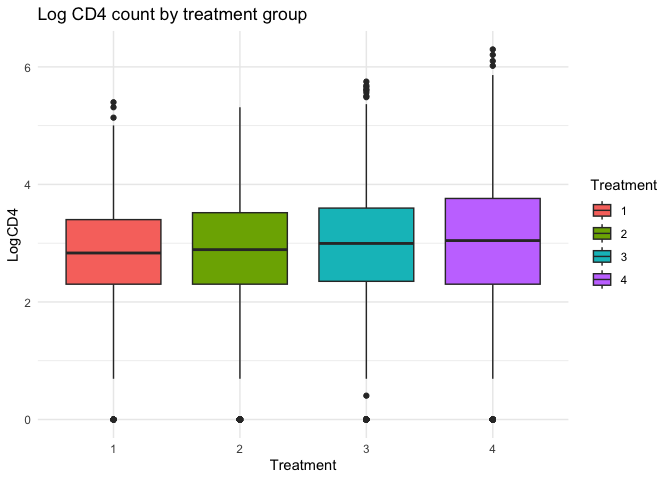
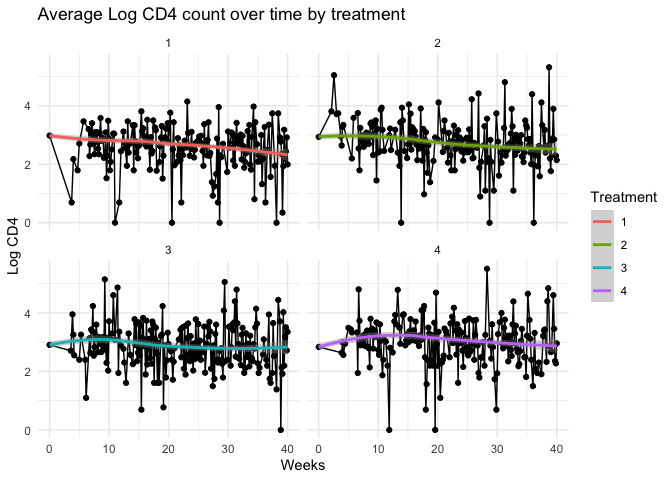
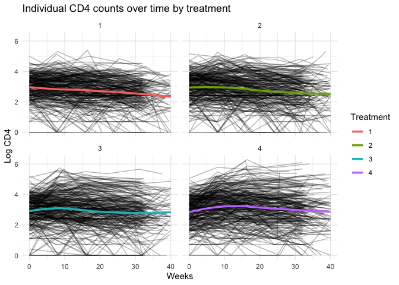
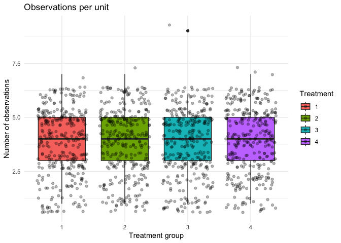
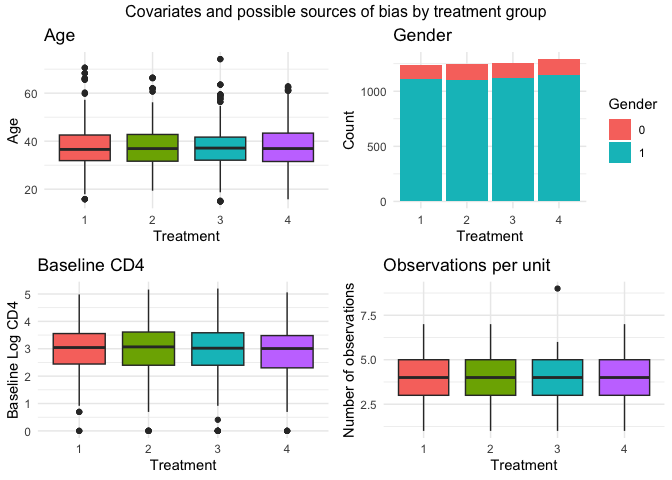
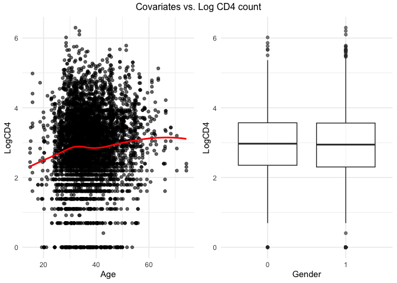

# Assignment 2b

``` r
# Set global chunk options for error handling
knitr::opts_chunk$set(error = TRUE)
```

## Preparing environment and data

``` r
library(tidyverse)
```

    ── Attaching core tidyverse packages ──────────────────────── tidyverse 2.0.0 ──
    ✔ dplyr     1.1.4     ✔ readr     2.1.5
    ✔ forcats   1.0.0     ✔ stringr   1.5.1
    ✔ ggplot2   3.5.1     ✔ tibble    3.2.1
    ✔ lubridate 1.9.3     ✔ tidyr     1.3.1
    ✔ purrr     1.0.2     
    ── Conflicts ────────────────────────────────────────── tidyverse_conflicts() ──
    ✖ dplyr::filter() masks stats::filter()
    ✖ dplyr::lag()    masks stats::lag()
    ℹ Use the conflicted package (<http://conflicted.r-lib.org/>) to force all conflicts to become errors

``` r
library(broom)
library(geepack)
library(nlme)
```


    Attaching package: 'nlme'

    The following object is masked from 'package:dplyr':

        collapse

``` r
cd4 <- read_csv("data/cd4data.csv")
```

    Rows: 5036 Columns: 6
    ── Column specification ────────────────────────────────────────────────────────
    Delimiter: ","
    dbl (6): ID, Treatment, Age, Gender, Week, LogCD4

    ℹ Use `spec()` to retrieve the full column specification for this data.
    ℹ Specify the column types or set `show_col_types = FALSE` to quiet this message.

``` r
cd4 <- cd4 |>
  mutate(
    Treatment = as.factor(Treatment),
    Gender = as.factor(Gender)
  )

glimpse(cd4)
```

    Rows: 5,036
    Columns: 6
    $ ID        <dbl> 1, 1, 1, 1, 1, 1, 2, 2, 2, 2, 2, 2, 3, 4, 4, 4, 4, 5, 5, 5, …
    $ Treatment <fct> 2, 2, 2, 2, 2, 2, 4, 4, 4, 4, 4, 4, 1, 3, 3, 3, 3, 1, 1, 1, …
    $ Age       <dbl> 36.4271, 36.4271, 36.4271, 36.4271, 36.4271, 36.4271, 47.846…
    $ Gender    <fct> 1, 1, 1, 1, 1, 1, 1, 1, 1, 1, 1, 1, 1, 1, 1, 1, 1, 1, 1, 1, …
    $ Week      <dbl> 0.0000, 7.5714, 15.5714, 23.5714, 32.5714, 40.0000, 0.0000, …
    $ LogCD4    <dbl> 3.135494, 3.044522, 2.772589, 2.833213, 3.218876, 3.044522, …

## 1) Explore the data using ggplot

Before beginning EDA, we should recount what is already known about the
data from the Henry et al. (1998) paper and data collection methods:

- Data are collected from a randomized, double-blind study of advanced
  AIDS patients.

- Patients were randomized to 1 of 4 daily regimens with regimens
  corresponding to different combinations of therapies.

- CD4 measurements were scheduled for collection at baseline and then
  every 8 weeks: but the CD4 count data are **unbalanced** due to
  mistimed measurements, missed visits, and dropout from the trial; this
  is something we should look into further during EDA to understand if
  the missingness may be biasing the results in any way.

To begin, we should look for high-level differences across the treatment
groups. (NOTE: all analysis going forward from here is based on the
assumption that we are investigating the effect of treatment on CD4
count)

``` r
theme_set(theme_minimal())

ggplot(cd4,  aes(x = Treatment, y = LogCD4)) +
  geom_boxplot(aes(fill = Treatment)) +
  labs(title = "Log CD4 count by treatment group")
```



This plot does not suggest that are any glaring difference between the
treatment groups in terms of aggregate CD4 count (although there is a
general trend of CD4 count increasing across each treatment group). This
is, however, an oversimplified visualization and we should look at how
the treatment differ **over time** to get a better sense of how
treatment may effect CD4 count.

``` r
ggplot(cd4, aes(x = Week, y = LogCD4)) +
  stat_summary(geom = "line", fun = mean) +
  stat_summary(geom = "point", fun = mean) +
  geom_smooth(method = "loess", aes(color = Treatment)) +
  facet_wrap(~Treatment) +
  labs(title = "Average Log CD4 count over time by treatment",
       x = "Weeks", y = "Log CD4")
```

    `geom_smooth()` using formula = 'y ~ x'



This plot suggests that are some patterned differences between treatment
groups, but that the general trend of CD4 count decreasing over time
appears to be roughly the same regardless of treatment assignment. It is
noteworthy that in treatment 3 (zidovudine plus 400mg of didanosine) and
treatment 4 (zidovudine plus 400mg of didanosine plus 400mg of
nevirapine) there seems to be a slightly more pronounced increase in
average CD4 counts in the initial weeks of treatment compared to
treatment 1 (zidovudine alternating monthly) and treatment 2 (zidovudine
plus 2.25mg of zalcitabine).

These are, however, still just aggregate trends. They do not adequately
represent the change in CD4 within-individuals in the different
treatment groups. This next plot explicitly shows the individual
trajectories underlying the fitted LOESS line.

``` r
ggplot(cd4, aes(x = Week, y = LogCD4, group = ID)) +
  geom_line(alpha = 0.3) +
  geom_smooth(aes(group = Treatment, color = Treatment), method = "loess", se = FALSE, 
              linewidth = 1.2) +
  facet_wrap(~Treatment) +
  labs(title = "Individual CD4 counts over time by treatment",
       x = "Weeks", y = "Log CD4")
```

    `geom_smooth()` using formula = 'y ~ x'



With this plot of the individual trajectories, we can see that there are
far more observations in the earlier weeks (i.e. dense clusters of black
lines/individual trajectories). In later weeks, the lines get
increasingly sparse due to loss to follow-up, dropouts, etc. There does
not appear to be any notable differences in losses to follow-up based on
this plot alone, but it is difficult to tell. It may be the case that
some of these differences are due to the lack of balance in the data
owing to dropout and/or missing measurements.

``` r
cd4 |>
  group_by(Treatment, ID) |>
  summarise(obs_count = n(), .groups = "drop") |>
  ggplot(aes(x = Treatment, y = obs_count, fill = Treatment)) +
  geom_boxplot() +
  geom_jitter(alpha = 0.3) +
  labs(title = "Observations per unit",
       x = "Treatment group", y = "Number of observations")
```



This plot suggest that there are not any patterned differences in the
number of observations per unit (i.e. number of follow-up measures per
person). To be sure that there are not other patterned differences
responsible for the observed differences between treatment groups,
however, we should nonetheless verify that measured covariates are
roughly balanced across treatment groups (NOTE: the Henry et al. (1998)
paper tells us that they are balanced, but for the sake of thoroughness,
I will verify this claim).

``` r
age <- ggplot(cd4, aes(x = Treatment, y = Age, fill = Treatment)) +
  geom_boxplot() +
  labs(title = "Age",
       x = "Treatment",
       y = "Age") +
  theme(legend.position = "none")

gender <- cd4 |>
  group_by(Treatment, Gender) |>
  summarise(count = n(), .groups = "drop") |> 
  ggplot(aes(x = Treatment, y = count, fill = Gender)) +
  geom_col(position = "stack") +
  labs(title = "Gender",
       x = "Treatment", 
       y = "Count")

baseline <- cd4 |> 
  filter(Week == 0) |>
  ggplot(aes(x = Treatment, y = LogCD4)) +
  geom_boxplot(aes(fill = Treatment)) +
  labs(title = "Baseline CD4",
       x = "Treatment",
       y = "Baseline Log CD4") +
  theme(legend.position = "none")

observations <- cd4 |>
  group_by(Treatment, ID) |>
  summarise(obs_count = n(), .groups = "drop") |>
  ggplot(aes(x = Treatment, y = obs_count, fill = Treatment)) +
  geom_boxplot() +
  labs(title = "Observations per unit",
       x = "Treatment", y = "Number of observations") +
  theme(legend.position = "none")

gridExtra::grid.arrange(age, gender, baseline, observations, ncol = 2,
                        top = "Covariates and possible sources of bias by treatment group")
```



This plot verifies that the covariates (including baseline CD4 and
observations per unit) are approximately balanced between the 4
treatment groups. We should also verify the relationship of the
covariates with the outcome:

``` r
age_outcome <- cd4 |> 
  ggplot(aes(x = Age, y = LogCD4)) +
  geom_point(alpha = 0.6) +
  geom_smooth(method = "loess", se = FALSE, color = "red") +
  labs(x = "Age", y = "LogCD4")

gender_outcome <- cd4 |> 
  ggplot(aes(x = Gender, y = LogCD4)) +
  geom_boxplot(alpha = 0.6) +
  labs(x = "Gender", y = "LogCD4")

gridExtra::grid.arrange(age_outcome, gender_outcome, ncol = 2,
                        top = "Covariates vs. Log CD4 count")
```

    `geom_smooth()` using formula = 'y ~ x'



Now that we have a general sense of the relationship between treatment
group and CD4 count over time and have verified the balance of
covariates and other biasing factors across treatment groups, we can
model.

## 2) Model the data using a linear model with correlated error terms

Given the small number of covariates, backwards selection will be used
to identify the adjustment set. Covariates that are not statistically
significant will be removed and if model fit (AIC/BIC) improves then the
covariate will be omitted from the final model. NOTE: to avoid
redundancy, covariate selection will be undertaken using the first
proposed model and the same covariates will be used to examine all
subsequent correlation structures.

``` r
glimpse(cd4)
```

    Rows: 5,036
    Columns: 6
    $ ID        <dbl> 1, 1, 1, 1, 1, 1, 2, 2, 2, 2, 2, 2, 3, 4, 4, 4, 4, 5, 5, 5, …
    $ Treatment <fct> 2, 2, 2, 2, 2, 2, 4, 4, 4, 4, 4, 4, 1, 3, 3, 3, 3, 1, 1, 1, …
    $ Age       <dbl> 36.4271, 36.4271, 36.4271, 36.4271, 36.4271, 36.4271, 47.846…
    $ Gender    <fct> 1, 1, 1, 1, 1, 1, 1, 1, 1, 1, 1, 1, 1, 1, 1, 1, 1, 1, 1, 1, …
    $ Week      <dbl> 0.0000, 7.5714, 15.5714, 23.5714, 32.5714, 40.0000, 0.0000, …
    $ LogCD4    <dbl> 3.135494, 3.044522, 2.772589, 2.833213, 3.218876, 3.044522, …

``` r
gls(LogCD4 ~ Treatment + Week + Age + Gender,
    data = cd4,
    correlation = corCompSymm(form = ~1 | ID)) |> summary()
```

    Generalized least squares fit by REML
      Model: LogCD4 ~ Treatment + Week + Age + Gender 
      Data: cd4 
           AIC      BIC    logLik
      12281.35 12340.05 -6131.673

    Correlation Structure: Compound symmetry
     Formula: ~1 | ID 
     Parameter estimate(s):
         Rho 
    0.658483 

    Coefficients:
                     Value  Std.Error    t-value p-value
    (Intercept)  2.5610407 0.14288829  17.923377  0.0000
    Treatment2   0.0407263 0.07350201   0.554084  0.5795
    Treatment3   0.1017004 0.07321142   1.389133  0.1649
    Treatment4   0.2344666 0.07305829   3.209308  0.0013
    Week        -0.0100902 0.00074062 -13.624035  0.0000
    Age          0.0114718 0.00317329   3.615097  0.0003
    Gender1     -0.1056758 0.07958968  -1.327757  0.1843

     Correlation: 
               (Intr) Trtmn2 Trtmn3 Trtmn4 Week   Age   
    Treatment2 -0.268                                   
    Treatment3 -0.277  0.502                            
    Treatment4 -0.261  0.502  0.504                     
    Week       -0.067  0.000  0.001 -0.003              
    Age        -0.787  0.000  0.010 -0.008  0.001       
    Gender1    -0.408  0.023  0.021  0.018 -0.012 -0.105

    Standardized residuals:
           Min         Q1        Med         Q3        Max 
    -3.0070441 -0.5133326  0.1003393  0.6686334  3.1868380 

    Residual standard error: 1.06781 
    Degrees of freedom: 5036 total; 5029 residual

Our full model has AIC of 12281.35 and BIC of 12340.05; only one
included covariate is not statistically significant (gender).

``` r
gls(LogCD4 ~ Treatment + Week + Age,
    data = cd4,
    correlation = corCompSymm(form = ~1 | ID)) |> summary()
```

    Generalized least squares fit by REML
      Model: LogCD4 ~ Treatment + Week + Age 
      Data: cd4 
           AIC      BIC    logLik
      12277.89 12330.07 -6130.943

    Correlation Structure: Compound symmetry
     Formula: ~1 | ID 
     Parameter estimate(s):
          Rho 
    0.6586755 

    Coefficients:
                     Value  Std.Error    t-value p-value
    (Intercept)  2.4835676 0.13047528  19.034776  0.0000
    Treatment2   0.0429678 0.07350830   0.584531  0.5589
    Treatment3   0.1037156 0.07322111   1.416472  0.1567
    Treatment4   0.2361901 0.07307228   3.232280  0.0012
    Week        -0.0101023 0.00074056 -13.641355  0.0000
    Age          0.0110293 0.00315686   3.493773  0.0005

     Correlation: 
               (Intr) Trtmn2 Trtmn3 Trtmn4 Week  
    Treatment2 -0.283                            
    Treatment3 -0.294  0.501                     
    Treatment4 -0.278  0.502  0.504              
    Week       -0.078  0.000  0.001 -0.003       
    Age        -0.914  0.002  0.013 -0.006  0.000

    Standardized residuals:
            Min          Q1         Med          Q3         Max 
    -3.01545696 -0.51209891  0.09385589  0.66462828  3.17147789 

    Residual standard error: 1.06809 
    Degrees of freedom: 5036 total; 5030 residual

With gender omitted from the model, there is a slight improvement in
model fit (AIC = 12277.89, BIC = 12330.07) and all remaining covariates
are statistically significant. We can also rest assured knowing that the
study used has a randomized design and, as evident in EDA, gender is
roughly balanced across treatment groups. Gender will be omitted from
the model going forward.

## GLS

### GLS (compound symmetry)

``` r
gls(LogCD4 ~ Treatment + Week + Age, 
    data = cd4, 
    correlation = corCompSymm(form = ~1 | ID)) |> summary()
```

    Generalized least squares fit by REML
      Model: LogCD4 ~ Treatment + Week + Age 
      Data: cd4 
           AIC      BIC    logLik
      12277.89 12330.07 -6130.943

    Correlation Structure: Compound symmetry
     Formula: ~1 | ID 
     Parameter estimate(s):
          Rho 
    0.6586755 

    Coefficients:
                     Value  Std.Error    t-value p-value
    (Intercept)  2.4835676 0.13047528  19.034776  0.0000
    Treatment2   0.0429678 0.07350830   0.584531  0.5589
    Treatment3   0.1037156 0.07322111   1.416472  0.1567
    Treatment4   0.2361901 0.07307228   3.232280  0.0012
    Week        -0.0101023 0.00074056 -13.641355  0.0000
    Age          0.0110293 0.00315686   3.493773  0.0005

     Correlation: 
               (Intr) Trtmn2 Trtmn3 Trtmn4 Week  
    Treatment2 -0.283                            
    Treatment3 -0.294  0.501                     
    Treatment4 -0.278  0.502  0.504              
    Week       -0.078  0.000  0.001 -0.003       
    Age        -0.914  0.002  0.013 -0.006  0.000

    Standardized residuals:
            Min          Q1         Med          Q3         Max 
    -3.01545696 -0.51209891  0.09385589  0.66462828  3.17147789 

    Residual standard error: 1.06809 
    Degrees of freedom: 5036 total; 5030 residual

Using a compound symmetry correlation structure implies that: i) the
variance of each repeated measure is constant, and ii) the correlation
between any two repeated measurements, regardless of their temporal or
ordinal distance, is the same. This means that within-individual
measures that are closer together in time are not assumed to be more or
less correlated than those further apart.

From a conceptual standpoint, this structure does not seem to align well
with our data. We would expect that measurements taken closer together
in time should be more strongly correlated with each other. By not
accounting for this in our correlation structure, we are likely
underestimating our standard errors, which may lead to overestimating
the effects of the treatment protocols.

### GLS (AR1)

``` r
gls(LogCD4 ~ Treatment + Week + Age,
    data = cd4,
    correlation = corAR1(form = ~1 | ID)) |> summary()
```

    Generalized least squares fit by REML
      Model: LogCD4 ~ Treatment + Week + Age 
      Data: cd4 
           AIC   BIC    logLik
      12434.81 12487 -6209.407

    Correlation Structure: AR(1)
     Formula: ~1 | ID 
     Parameter estimate(s):
          Phi 
    0.6937666 

    Coefficients:
                     Value  Std.Error   t-value p-value
    (Intercept)  2.4729471 0.12036989 20.544565  0.0000
    Treatment2   0.0291279 0.06735085  0.432481  0.6654
    Treatment3   0.0889230 0.06717220  1.323806  0.1856
    Treatment4   0.1927546 0.06694144  2.879451  0.0040
    Week        -0.0081612 0.00109888 -7.426795  0.0000
    Age          0.0103675 0.00289701  3.578681  0.0003

     Correlation: 
               (Intr) Trtmn2 Trtmn3 Trtmn4 Week  
    Treatment2 -0.282                            
    Treatment3 -0.293  0.502                     
    Treatment4 -0.274  0.504  0.505              
    Week       -0.130  0.000  0.001 -0.006       
    Age        -0.909  0.002  0.014 -0.008  0.000

    Standardized residuals:
           Min         Q1        Med         Q3        Max 
    -2.9725695 -0.4928003  0.1202897  0.6912773  3.2516443 

    Residual standard error: 1.055201 
    Degrees of freedom: 5036 total; 5030 residual

In contrast to compound symmetry, AR(1) explicitly incorporates the idea
that measurements taken closer together in time should be more strongly
correlated than those further apart. This feature of AR(1) makes it
potentially more suitable for our data than compound symmetry. However,
it is important to note that AR(1) assumes measurements are taken at
equal and consistent intervals. This assumption is violated in our data
due to missing measurements and losses to follow-up, which could lead to
an overestimation of the correlation between some measurements,
potentially resulting in artificially low standard errors.

### GLS (unstructured)

``` r
gls(LogCD4 ~ Treatment + Week + Age,
    data = cd4,
    correlation = corSymm(form = ~1 | ID)) |> summary()
```

    Error in gls(LogCD4 ~ Treatment + Week + Age, data = cd4, correlation = corSymm(form = ~1 | : function evaluation limit reached without convergence (9)

An unstructured correlation structure is the most flexible compared to
compound symmetry and AR(1). Instead of imposing specific assumptions
about the correlation between measurements, this structure freely
estimates every pairwise correlation between repeated measurements. As
such, it is driven by the data itself, unlike compound symmetry and
AR(1), which are fitted to the data with predefined assumptions.

Here, we are running into a convergence issue. Because we are estimating
correlations for each pair of time points within each individual, the
computational complexity associated with this may be causing
non-convergence. The non-convergence may also be a result of the
unbalanced data: because some individuals have more repeated
measurements than others, the unstructured correlation model may, in
effect, be drastically overfitting/underfitting the model to certain
individuals.

## GEE GLM

Compared to a GLS approach, using a GEE GLM to account for correlated
data is a more ‘robust’ approach in that it is less sensitive to
correlation structure misspecification. A GLS approach assumes that we
are specifying the true correlation structure and thus directly models
the correlation structure whereas a GEE GLM approach only assumes that
we specify a working (and somewhat arbitrary) correlation structure.

### GEE GLM (compound symmetry)

``` r
geeglm(LogCD4 ~ Treatment + Week + Age,
       data = cd4,
       id = ID,
       family = gaussian,
       corstr = "exchangeable") |> tidy()
```

    # A tibble: 6 × 5
      term        estimate std.error statistic  p.value
      <chr>          <dbl>     <dbl>     <dbl>    <dbl>
    1 (Intercept)   2.48    0.130      366.    0       
    2 Treatment2    0.0428  0.0666       0.414 0.520   
    3 Treatment3    0.103   0.0704       2.16  0.142   
    4 Treatment4    0.236   0.0724      10.6   0.00111 
    5 Week         -0.0101  0.000879   133.    0       
    6 Age           0.0110  0.00312     12.5   0.000409

### GEE GLM (AR1)

``` r
geeglm(LogCD4 ~ Treatment + Week + Age,
       data = cd4,
       id = ID,
       family = gaussian,
       corstr = "ar1") |> tidy()
```

    # A tibble: 6 × 5
      term        estimate std.error statistic  p.value
      <chr>          <dbl>     <dbl>     <dbl>    <dbl>
    1 (Intercept)  2.49      0.127     385.    0       
    2 Treatment2   0.0232    0.0656      0.125 0.724   
    3 Treatment3   0.0675    0.0681      0.983 0.321   
    4 Treatment4   0.171     0.0702      5.90  0.0151  
    5 Week        -0.00871   0.00100    75.4   0       
    6 Age          0.0101    0.00303    11.1   0.000850

### GEE GLM (unstructured)

``` r
geeglm(LogCD4 ~ Treatment + Week + Age,
       data = cd4,
       id = ID,
       family = gaussian,
       corstr = "unstructured") |> tidy()
```

    # A tibble: 6 × 5
      term        estimate std.error statistic  p.value
      <chr>          <dbl>     <dbl>     <dbl>    <dbl>
    1 (Intercept)   2.54     0.137     345.    0       
    2 Treatment2    0.0394   0.0650      0.367 0.544   
    3 Treatment3    0.0805   0.0940      0.733 0.392   
    4 Treatment4    0.173    0.0695      6.23  0.0125  
    5 Week         -0.0126   0.00131    91.6   0       
    6 Age           0.0106   0.00321    10.9   0.000982

``` r
models_all <- list(
  "GLS Compound Symmetry (SE)" = gls(LogCD4 ~ Treatment + Week + Age, 
                                  data = cd4, 
                                  correlation = corCompSymm(form = ~1 | ID)),
  "GEE GLM Compound Symmetry (SE)" = geeglm(LogCD4 ~ Treatment + Week + Age, data = cd4, id = ID,
                                         family = gaussian, corstr = "exchangeable"),
  "GLS AR1 (SE)" = gls(LogCD4 ~ Treatment + Week + Age,
                    data = cd4,
                    correlation = corAR1(form = ~1 | ID)),
  "GEE GLM AR1 (SE)" = geeglm(LogCD4 ~ Treatment + Week + Age, data = cd4, id = ID, 
                           family = gaussian, corstr = "ar1"),
  "GEE GLM Unstructured (SE)" = geeglm(LogCD4 ~ Treatment + Week + Age, data = cd4, id = ID, 
                          family = gaussian, corstr = "unstructured")
)

modelsummary::modelsummary(models_all, 
                           digits = 3,
                           estimate = "{estimate} ({std.error})",
                           statistic = "p = {p.value}")
```

|             | GLS Compound Symmetry (SE) | GEE GLM Compound Symmetry (SE) | GLS AR1 (SE)   | GEE GLM AR1 (SE) | GEE GLM Unstructured (SE) |
|-------------|----------------------------|--------------------------------|----------------|------------------|---------------------------|
| (Intercept) | 2.484 (0.130)              | 2.484 (0.130)                  | 2.473 (0.120)  | 2.486 (0.127)    | 2.538 (0.137)             |
|             | p = \<0.001                | p = \<0.001                    | p = \<0.001    | p = \<0.001      | p = \<0.001               |
| Treatment2  | 0.043 (0.074)              | 0.043 (0.067)                  | 0.029 (0.067)  | 0.023 (0.066)    | 0.039 (0.065)             |
|             | p = 0.559                  | p = 0.520                      | p = 0.665      | p = 0.724        | p = 0.544                 |
| Treatment3  | 0.104 (0.073)              | 0.103 (0.070)                  | 0.089 (0.067)  | 0.068 (0.068)    | 0.080 (0.094)             |
|             | p = 0.157                  | p = 0.142                      | p = 0.186      | p = 0.321        | p = 0.392                 |
| Treatment4  | 0.236 (0.073)              | 0.236 (0.072)                  | 0.193 (0.067)  | 0.171 (0.070)    | 0.173 (0.069)             |
|             | p = 0.001                  | p = 0.001                      | p = 0.004      | p = 0.015        | p = 0.013                 |
| Week        | -0.010 (0.001)             | -0.010 (0.001)                 | -0.008 (0.001) | -0.009 (0.001)   | -0.013 (0.001)            |
|             | p = \<0.001                | p = \<0.001                    | p = \<0.001    | p = \<0.001      | p = \<0.001               |
| Age         | 0.011 (0.003)              | 0.011 (0.003)                  | 0.010 (0.003)  | 0.010 (0.003)    | 0.011 (0.003)             |
|             | p = \<0.001                | p = \<0.001                    | p = \<0.001    | p = \<0.001      | p = \<0.001               |
| Num.Obs.    | 5036                       | 5036                           | 5036           | 5036             | 5036                      |
| R2          | 0.022                      | 0.022                          | 0.021          | 0.018            | 0.017                     |
| AIC         | 12239.3                    | 14951.5                        | 12396.1        | 14972.5          | 14979.1                   |
| BIC         | 12291.5                    | 14997.2                        | 12448.3        | 15018.1          | 15024.8                   |
| Log.Lik.    |                            | -7468.746                      |                | -7479.230        | -7482.571                 |
| F           |                            | 34.689                         |                | 20.382           | 33.989                    |
| RMSE        | 1.07                       | 1.07                           | 1.07           | 1.07             | 1.07                      |

With both GLS and GEE GLM approaches, we observe differences in standard
errors and point estimates when using different correlation structures.
While there were some differences in the specific point estimates and
standard errors produced, the overall trends and conclusions were
similar between the models.

A key difference between the models lies in overall model fit. The GLS
models consistently outperformed the GEE GLM models in terms of AIC,
BIC, and R². This is expected: GLS estimation is optimized for
efficiency and uses a full-likelihood estimation method, directly
modeling the correlation structure, whereas GEE is optimized for
robustness and employs a quasi-likelihood estimation method. The
trade-off is that when the correlation structure is specified correctly,
GLS produces more efficient estimates but is sensitive to
misspecification. On the other hand, GEE provides consistent estimates
even when the correlation structure is misspecified.

Despite these methodological differences, the main findings and
conclusions remain unchanged: Only treatment 4 (zidovudine plus 400mg of
didanosine and 400mg of nevirapine) is significantly better than
treatment 1 (zidovudine alternating monthly), while the other treatments
do not show significant differences in efficacy.

## 3) Discuss the research questions you are able to explore using a linear model with correlated error terms

1.  How effective are different therapies?

Linear models with correlated error terms are well-suited for modeling
the efficacy of different therapies. By incorporating correlated error
terms (via GEE or GLS), these models provide more accurate and valid
standard error estimates by accounting for within-subject correlation
due to repeated measurements. In contrast, a standard linear model
without correlated error terms assumes no correlation between
measurements from the same subject, which can lead to artificially low
standard errors and narrow confidence intervals.

2.  How do the effectiveness of therapies differ according to patient
    characteristics (treatment effect heterogeneity)?

Linear models with correlated error terms are suitable for comparing
therapies wherein the effects of therapies may differ according to
certain patient characteristics. While not the focus of this analysis,
linear models with correlated error terms (like all linear models) allow
for exploration of effect modification via the inclusion of interaction
terms. It may, for instance, be the case that some treatments are
particularly effective for younger patients while others are
particularly effective for older patients.

3.  How are observations correlated with one another?

A key aspect of linear models with correlated error terms is that the
specification of the correlation structure itself is often of scientific
interest. As discussed in Question 2, different correlation structures
make different assumptions about how observations are correlated, and
choosing the appropriate structure can provide valuable insights into
the nature of the data.

### Limitations to linear models with correlated error terms

There are also important limitations to note when using linear models
with correlated error terms. Linear models with correlated error terms
do not explicitly model variability the same way that mixed-effects
models do. We may, for example, want to know whether certain therapies
are more effective for certain patients. A linear model with correlated
error terms limits us to average estimations: while we can estimate how
effective a treatment is depending on certain characteristics after
accounting for within-individual correlations, we cannot estimate
unobserved individual-specific deviations from those averages. A
mixed-effects model, by contrast, allows us to estimate a random slope
for each individual thereby estimating how effective treatment is for a
particular individual.
